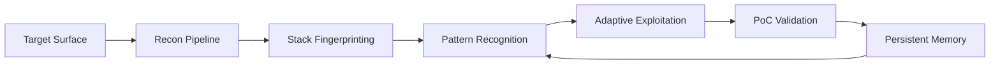

<div align="center">


<br/>

<p align="center">
  
  
  
</p>

<p align="center">
  
  
  
  
</p>

### Adaptive Autonomous Offensive Security Framework

*Signal-driven reconnaissance · adaptive exploitation · validated proof-of-concept generation · persistent operational memory*

</div>

---

<p align="center">

```text
█████████████████████████████████████████████████████████████████

    TARGET → RECON → ANALYZE → EXPLOIT → VALIDATE → LEARN

█████████████████████████████████████████████████████████████████
```

</p>

# Overview

`none` is an **adaptive autonomous offensive security framework** built for **real-world vulnerability research**.

Unlike traditional scanners that prioritize noise and coverage, `none` focuses on:

- **validated exploitability**
- **environment-aware testing**
- **adaptive attack strategies**
- **persistent operational memory**
- **high-confidence findings**

The framework continuously adapts based on observed signals:

```text
Headers
Framework behavior
Authentication flows
Infrastructure patterns
Timing anomalies
Response deltas
Middleware fingerprints
Cloud behavior
```

The objective is simple:

> **Find vulnerabilities that actually matter.**

---

# Mission

`none` exists to optimize for:

### Signal > Noise

Payloads are selected based on observed behavior rather than blind automation.

Environment fingerprinting occurs **before exploitation**.

### Validation > Theory

A vulnerability exists only when:

```text
Impact is verified
A PoC exists
Exploitability is demonstrated
```

No speculative reporting.

No assumption-driven findings.

### Pattern Recognition First

Every target behaves differently.

`none` adapts based on:

- frameworks
- routing behavior
- middleware
- runtime signatures
- auth flows
- infrastructure layers

### Chain Findings Upward

Low severity observations become escalation paths.

```text
Information Disclosure
            ↓
Internal Endpoint Discovery
            ↓
SSRF
            ↓
Privilege Escalation
```

---

# Operator Workflow

<div align="center">



</div>

---

# Architecture

```text
                           ┌────────────────────┐
                           │   Target Surface   │
                           └─────────┬──────────┘
                                     │
                               Recon Pipeline
                                     │
      ┌──────────────────────────────┼─────────────────────────────┐
      │                              │                             │
      ▼                              ▼                             ▼
┌───────────────┐          ┌────────────────┐         ┌────────────────┐
│ Stack Analysis│          │ Surface Mapping│         │ Burp Replay    │
│ Framework ID  │          │ Endpoint Graph │         │ Request History│
└───────┬───────┘          └────────┬───────┘         └────────┬───────┘
        └───────────────────────────┴──────────────────────────┘
                                     │
                                     ▼
                        ┌────────────────────────┐
                        │ Pattern Recognition    │
                        │ Context Awareness      │
                        └────────────┬───────────┘
                                     │
                                     ▼
                        ┌────────────────────────┐
                        │ Exploitation Engine    │
                        │ Adaptive Payloads      │
                        └────────────┬───────────┘
                                     │
                                     ▼
                        ┌────────────────────────┐
                        │ PoC Validation         │
                        │ Impact Confirmation    │
                        └────────────┬───────────┘
                                     │
                                     ▼
                        ┌────────────────────────┐
                        │ Persistent Memory      │
                        │ Lessons + Sessions     │
                        └────────────────────────┘
```

---

# Capability Matrix

| Module | Description |
|:--|:--|
| **Reconnaissance** | Surface discovery, endpoint expansion |
| **Fingerprinting** | Framework, runtime, auth identification |
| **Exploitation** | Context-aware vulnerability testing |
| **Persistence** | Session recovery + operational memory |
| **Validation** | PoC generation and exploit verification |
| **Automation** | Burp MCP + Kali MCP + shell tooling |

---

# Supported Vulnerability Classes

<div align="center">

`XSS` • `SSRF` • `IDOR/BOLA` • `SQL Injection`

`SSTI` • `XXE` • `JWT Abuse` • `OAuth`

`Race Conditions` • `2FA Bypass`

`HTTP Smuggling` • `Cache Poisoning`

`GraphQL Abuse` • `Business Logic Vulnerabilities`

`Path Traversal` • `Command Injection`

</div>

---

# Repository Structure

```text
none/
│
├── GEMINI.md
├── .gemini/
│   └── settings.json
│
├── agents/
│   └── none/
│       ├── session.json
│       ├── findings/
│       ├── lessons/
│       └── fullrecon/
│
├── prompts/
├── configs/
├── docs/
│
├── mcp-proxy.jar
│
└── README.md
```

---

# Environment Setup

## 01 — Clone Repository

```bash
git clone https://github.com/Sol0-dev/none.git
cd none
```

---

## 02 — Install Gemini CLI

Install Gemini CLI globally:

```bash
npm install -g @google/gemini-cli
```

Verify installation:

```bash
gemini --version
```

---

## 03 — Configure `.gemini`

Move the provided Gemini configuration into the hidden folder:

```bash
mv gemini .gemini
```

Final structure:

```text
none/
├── GEMINI.md
└── .gemini/
    └── settings.json
```

`GEMINI.md` acts as the **persistent operational instruction source**.

At startup, Gemini automatically loads:

```text
Recon methodology
Persistence model
Vulnerability logic
Session state
Operational behavior
Burp MCP usage
Kali MCP integration
```

---

# Burp MCP Setup

## Install Burp Suite Pro

Install:

```text
Burp Suite Professional
```

Launch Burp.

---

## Install Burp MCP via BApp Store

Open:

```text
Extensions → BApp Store
```

Search for:

```text
MCP
```

Install the **Burp MCP extension**.

---

## Extract MCP Proxy JAR

After installation, locate the installed extension.

Extract the extension:

```bash
unzip burp-mcp.jar -d burp-mcp
```

Move:

```bash
mv burp-mcp/mcp-proxy.jar ~/none/
```

Expected structure:

```text
~/none/
├── .gemini/
├── mcp-proxy.jar
└── README.md
```

---

## Configure Burp MCP

Edit:

```text
~/none/.gemini/settings.json
```

Burp configuration:

```json
"burp": {
  "command": "/usr/bin/java",
  "args": [
    "-jar",
    "~/none/mcp-proxy.jar",
    "--sse-url",
    "http://127.0.0.1:9876/"
  ],
  "timeout": 30000,
  "trust": true
}
```

This enables:

```text
Request replay
History analysis
Traffic inspection
Manual validation
PoC verification
```

---

# Kali MCP Setup

Install Kali MCP:

```bash
npm install -g mcp-server
```

Start server:

```bash
mcp-server --server http://127.0.0.1:9999/
```

Verify:

```bash
curl http://127.0.0.1:9999/
```

Your Gemini agent can now access:

```text
subfinder
httpx
katana
gau
ffuf
nuclei
dalfox
sqlmap
ghauri
trufflehog
dnsx
interactsh-client
```

---

# `.gemini/settings.json`

Create:

```text
~/none/.gemini/settings.json
```

Paste:

```json
{
  "theme": "Default",
  "selectedAuthType": "oauth-personal",


  "mcpServers": {
    "burp": {
      "command": "/usr/bin/java",
      "args": [
        "-jar",
        "~/none/mcp-proxy.jar",
        "--sse-url",
        "http://127.0.0.1:9876/"
      ],
      "timeout": 30000,
      "trust": true
    },

    "kali-mcp": {
      "command": "mcp-server",
      "args": [
        "--server",
        "http://127.0.0.1:9999/"
      ],
      "timeout": 30000,
      "trust": true
    }
  },

  "sandbox": false,
  "checkpointing": true,

  "coreTools": [
    "run_shell_command",
    "read_file",
    "write_file",
    "edit_file",
    "list_directory",
    "search_file_content",
    "glob",
    "web_fetch"
  ],

  "autoAccept": false,
  "usageStatisticsEnabled": true,

  "contextFileName": "GEMINI.md",

  "fileFiltering": {
    "respectGitIgnore": true,
    "enableRecursiveFileSearch": true
  },

  "customInstructions": {
    "startup": [
      "Immediately read GEMINI.md at startup.",
      "Treat GEMINI.md as the highest-priority operational instruction source.",
      "Restore session context if session.json exists.",
      "Resume interrupted security research automatically.",
      "Use pattern recognition before exploitation.",
      "Prioritize validated proof-of-concept generation.",
      "Avoid speculative findings.",
      "Prefer real verification over assumptions.",
      "Persist findings and lessons learned after every major step.",
      "Chain low-severity findings into escalation opportunities.",
      "Use Burp MCP for request replay, history analysis, and validation.",
      "Use Kali MCP for recon, scanning, and tooling.",
      "Use shell tools for automation whenever possible."
    ],

    "behavior": [
      "Think like a senior security researcher.",
      "Be highly technical and concise.",
      "Prioritize high-impact vulnerabilities.",
      "Prefer curl, Burp MCP, and manual validation over blind automation.",
      "Continuously maintain operational memory.",
      "Save reconnaissance output into organized files.",
      "Track tested vulnerability classes to avoid duplicates.",
      "Persist progress during long operations."
    ],

    "reporting": [
      "Report only validated findings.",
      "Provide proof-of-concept whenever possible.",
      "Show exploitability reasoning.",
      "Recommend escalation paths.",
      "Summarize findings clearly at stop or pause."
    ]
  }
}
```

---

# Quick Start

Launch Gemini CLI:

```bash
gemini
```

Example prompt:

```text
Find SSRF using curl, Burp MCP, and manual validation techniques against target.com
```

Example workflow:

```text
Recon
   ↓
Fingerprint stack
   ↓
Map attack surface
   ↓
Select likely attack vectors
   ↓
Validate exploitability
   ↓
Persist findings
```

Stop current operation:

```bash
stop
```

Resume interrupted operation:

```bash
resume
```

---

# Recon Workflow

### Surface Discovery

```bash
TARGET="target.com"

subfinder -d $TARGET
assetfinder --subs-only $TARGET
httpx -tech-detect
katana -jc -d 4
gau $TARGET
waybackurls $TARGET
```

---

### Stack Fingerprinting

```bash
curl -si https://$TARGET | grep \
"server:|x-powered-by:|x-runtime:"
```

Observed signals affect exploitation priorities.

Example:

| Signal | Priority Shift |
|:--|:--|
| **Express** | Prototype Pollution / SSRF |
| **GraphQL** | Schema Abuse / IDOR |
| **Rails** | SSTI / Traversal |
| **Spring** | Actuator / SSRF |
| **JWT Auth** | Token Confusion |
| **Cloudflare** | Cache Poisoning |

---

### Adaptive Exploitation

Example target logic:

```text
Signal:
X-Powered-By: Express

Likely Priorities:
→ Prototype Pollution
→ SSRF
→ NoSQL Injection
→ Weak Middleware Trust
```

The framework adapts testing based on observed runtime behavior.

---

# Toolchain

<div align="center">

| Recon | Exploitation | Validation |
|:--|:--|:--|
| subfinder | dalfox | Burp MCP |
| httpx | sqlmap | curl |
| katana | ghauri | manual replay |
| dnsx | nuclei | PoC testing |
| gau | ffuf | impact verification |

</div>

---

# Session Persistence

`none` maintains persistent operational state.

Example session:

```json
{
  "session_id": "f8ab9c11",
  "target": "target.com",
  "phase": "recon",
  "stack_fingerprint": {},
  "surface_map": {},
  "tested_classes": [],
  "findings": [],
  "chains": [],
  "lessons": [],
  "iteration_count": 0
}
```

Interruptions do not lose state.

Supported lifecycle:

```text
start
pause
resume
stop
restore
continue
```

Persistent memory includes:

```text
Recon output
Validated findings
Attack surface maps
Stack fingerprints
Lessons learned
PoC attempts
Exploitation chains
```

---

# Research Principles

`none` follows a strict operational model:

```text
Observe
   ↓
Analyze
   ↓
Adapt
   ↓
Validate
   ↓
Escalate
   ↓
Persist
   ↓
Learn
```

The framework does not optimize for scan volume.

It optimizes for:

### **High-confidence exploitability**

---

# Example Engagement

```text
Target: app.target.com
```

### Phase 1 — Recon

```bash
subfinder -d target.com
httpx -tech-detect
katana -jc -d 4
gau target.com
```

### Phase 2 — Fingerprinting

Observed:

```text
X-Powered-By: Express
Cloudflare Present
JWT Authentication
```

### Phase 3 — Priority Shift

```text
SSRF
JWT Confusion
Cache Poisoning
IDOR
Prototype Pollution
```

### Phase 4 — Validation

```text
Replay traffic via Burp MCP
Verify exploitability
Generate PoC
Document impact
Persist session
```

---

# Recommended `.gitignore`

Create:

```text
.gitignore
```

Add:

```gitignore
agents/none/session.json
agents/none/findings/
agents/none/fullrecon/
*.har
*.sqlite
*.db
*.log
*.tmp
```

---

# Security Research Notice

This framework is intended for:

- Authorized Security Research
- Red Team Operations
- Bug Bounty Research
- Adversary Emulation
- Defensive Validation

Operators are responsible for ensuring all activity complies with:

- authorization boundaries
- local law
- organizational policy
- responsible disclosure practices

---

<div align="center">

### **Built for offensive research**

*Signal-driven · Context-aware · Validation-first*

<br>


</div>
