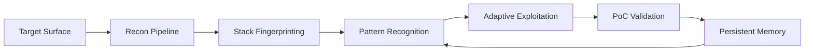

<div align="center">


<br/>

<p align="center">
  
  
  
</p>

<p align="center">
  
  
  
</p>

<br>

### **Adaptive Autonomous Offensive Security Framework**

*Signal-driven reconnaissance, adaptive exploitation, validated proof-of-concept generation, and persistent operational memory.*

</div>

---

```text
██████████████████████████████████████████████████████████

   TARGET → RECON → ANALYZE → EXPLOIT → VALIDATE → LEARN

██████████████████████████████████████████████████████████
```

## Mission

`none` is designed for one objective:

> **Find vulnerabilities that actually matter.**

The framework prioritizes **validated exploitability** over speculative findings.

Instead of blindly throwing payloads, `none` adapts to the environment through:

```text
▸ Stack Fingerprinting
▸ Surface Mapping
▸ Behavioral Analysis
▸ Exploit Adaptation
▸ Session Persistence
▸ Vulnerability Chaining
```

---

## Operator Model

<div align="center">



</div>

---

## Core Philosophy

<table>
<tr>
<td width="50%">

### Signal > Noise

Environment-aware testing.

Payloads are chosen from observed behavior, response anomalies, and stack fingerprints.

</td>
<td width="50%">

### Validation > Theory

No speculative findings.

A vulnerability exists only when impact is verified.

</td>
</tr>

<tr>
<td width="50%">

### Pattern Recognition

Frameworks, auth models, middleware, and infrastructure influence attack paths.

</td>
<td width="50%">

### Chain Upward

Small weaknesses become high-impact exploit chains.

`Info Leak → SSRF → Internal Access`

</td>
</tr>
</table>

---

## Capability Matrix

| Module | Capability |
|:---|:---|
| **Recon** | Subdomains, JS crawling, endpoint discovery |
| **Fingerprinting** | Frameworks, runtime behavior, cloud infra |
| **Exploitation** | XSS, SSRF, IDOR, SSTI, SQLi, JWT |
| **Automation** | Burp MCP, Kali MCP, shell tooling |
| **Persistence** | Session restore + operational memory |
| **Validation** | Real proof-of-concept verification |

---

## Attack Surface Workflow

```text
                   ┌──────────────────┐
                   │ Target Surface   │
                   └────────┬─────────┘
                            │
                 Passive / Active Recon
                            │
        ┌───────────────────┼──────────────────┐
        │                   │                  │
        ▼                   ▼                  ▼
 Framework ID       Endpoint Mapping      Burp Replay
        └───────────────────┬──────────────────┘
                            │
                  Behavioral Recognition
                            │
                    Adaptive Exploitation
                            │
                       PoC Validation
                            │
                    Chain Escalation
                            │
                     Persistent Memory
```

---

## Supported Classes

<div align="center">

`XSS` • `SSRF` • `IDOR/BOLA` • `SQLi` • `SSTI` • `JWT` • `OAuth`

`2FA Bypass` • `Race Conditions` • `HTTP Smuggling`

`Cache Poisoning` • `GraphQL Abuse` • `Business Logic`

</div>

---

## Quick Start

### Installation

```bash
git clone https://github.com/Sol0-dev/none.git
cd none

npm install -g @google/gemini-cli
```

Install MCP integrations:

- Burp Suite Pro + MCP Extension
- Kali MCP
- Tool dependencies

### Start Session

```bash
gemini
```

```text
find SSRF using curl, burp mcp and other tools hunt to target.com
```

Stop operation:

```bash
stop
```

Resume operation:

```bash
resume
```

---

## Toolchain

```text
subfinder      httpx         nuclei
katana         ffuf          dalfox
sqlmap         ghauri        trufflehog
gau            dnsx          interactsh
burp-mcp       kali-mcp      gemini-cli
```

---

## Research Notice

This framework is intended for:

- Authorized Security Research
- Red Team Operations
- Bug Bounty Research
- Defensive Validation
- Adversary Emulation

Operate within authorization boundaries.

---

<div align="center">

### **Built for offensive research**

*Signal-driven · Context-aware · Validation-first*

</div>
